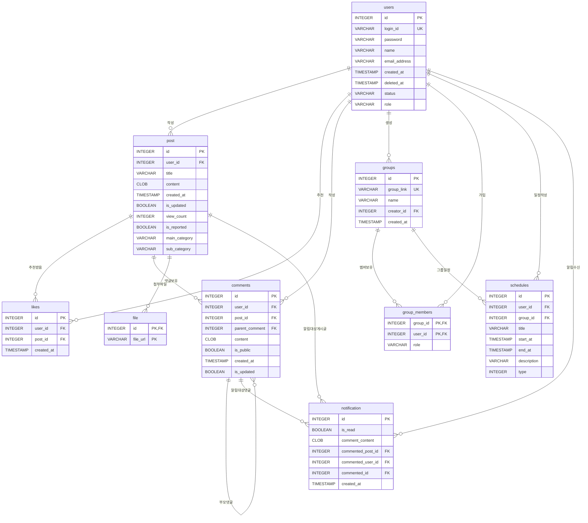

# ERD

## 1. 기준 문서

- 요구사항: `docs/source/requirements.md`
- 논리 스키마: `docs/source/logical-schema.md`
- 루트 ERD 이미지: `erd_수정.png`

## 2. 범례

- `PK`: 기본키
- `FK`: 외래키
- `UK`: 유니크 제약
- `NN`: NOT NULL
- `NULL`: NULL 허용

## 3. 원본 ERD 이미지

## 4. 전체 ERD

## 5. 엔티티 상세

### 5-1. users

회원 계정을 저장한다. 요구사항에서 회원은 `login_id`가 아니라 `id`로 식별된다.

| 컬럼 | 타입 | 키/제약 | NULL | 설명 |
|---|---:|---|---|---|
| `id` | INTEGER | PK, identity | NN | 회원 식별자 |
| `login_id` | VARCHAR(50) | UK | NN | 로그인 아이디. 중복 불가 |
| `password` | VARCHAR(255) |  | NN | 비밀번호 |
| `name` | VARCHAR(50) |  | NN | 이름 또는 닉네임 |
| `email_address` | VARCHAR(255) |  | NN | 이메일 주소 |
| `created_at` | TIMESTAMP | default current timestamp | NN | 가입 일시 |
| `deleted_at` | TIMESTAMP |  | NULL | 회원 탈퇴 일시 |
| `status` | VARCHAR(20) | default `ACTIVE`, allowed `ACTIVE`, `DELETED` | NN | 회원 상태 |
| `role` | VARCHAR(20) |  | NULL | 사용자 역할 구분 |

### 5-2. post

회원이 작성한 게시글을 저장한다.

| 컬럼 | 타입 | 키/제약 | NULL | 설명 |
|---|---:|---|---|---|
| `id` | INTEGER | PK, identity | NN | 게시글 식별자 |
| `user_id` | INTEGER | FK → `users.id` | NN | 게시글 작성자 |
| `title` | VARCHAR(255) |  | NN | 게시글 제목 |
| `content` | CLOB |  | NULL | 게시글 본문 |
| `created_at` | TIMESTAMP | default current timestamp | NN | 작성 일시 |
| `is_updated` | BOOLEAN | default false | NN | 수정 여부 |
| `view_count` | INTEGER | default 0, `>= 0` | NN | 조회수 |
| `is_reported` | BOOLEAN | default false | NN | 신고 여부 |
| `main_category` | VARCHAR(100) |  | NN | 대주제, 학과 |
| `sub_category` | VARCHAR(100) |  | NN | 소주제, 과목 |

### 5-3. likes

회원의 게시글 추천 이력을 저장한다.

| 컬럼 | 타입 | 키/제약 | NULL | 설명 |
|---|---:|---|---|---|
| `id` | INTEGER | PK, identity | NN | 추천 식별자 |
| `user_id` | INTEGER | FK → `users.id`, UK(`user_id`, `post_id`) | NN | 추천한 회원 |
| `post_id` | INTEGER | FK → `post.id`, UK(`user_id`, `post_id`) | NN | 추천받은 게시글 |
| `created_at` | TIMESTAMP | default current timestamp | NN | 추천 일시 |

### 5-4. comments

게시글의 댓글과 대댓글을 하나의 테이블에 저장한다. 대댓글은 `parent_comment`로 부모 댓글을 참조한다.

| 컬럼 | 타입 | 키/제약 | NULL | 설명 |
|---|---:|---|---|---|
| `id` | INTEGER | PK, identity | NN | 댓글 식별자 |
| `user_id` | INTEGER | FK → `users.id` | NN | 댓글 작성자 |
| `post_id` | INTEGER | FK → `post.id` | NN | 댓글이 작성된 게시글 |
| `parent_comment` | INTEGER | FK → `comments.id` | NULL | 부모 댓글. NULL이면 최상위 댓글 |
| `content` | CLOB |  | NN | 댓글 또는 대댓글 내용 |
| `is_public` | BOOLEAN | default true | NN | 공개 여부 |
| `created_at` | TIMESTAMP | default current timestamp | NN | 작성 일시 |
| `is_updated` | BOOLEAN | default false | NN | 수정 여부 |

### 5-5. groups

스터디 그룹 정보를 저장한다.

| 컬럼 | 타입 | 키/제약 | NULL | 설명 |
|---|---:|---|---|---|
| `id` | INTEGER | PK, identity | NN | 그룹 식별자 |
| `group_link` | VARCHAR(255) | UK | NN | 그룹 초대 링크 |
| `name` | VARCHAR(100) |  | NN | 그룹명 |
| `creator_id` | INTEGER | FK → `users.id` | NN | 그룹 생성자 |
| `created_at` | TIMESTAMP | default current timestamp | NN | 생성 일시 |

### 5-6. group_members

회원과 그룹의 다대다 관계를 저장한다.

| 컬럼 | 타입 | 키/제약 | NULL | 설명 |
|---|---:|---|---|---|
| `group_id` | INTEGER | PK, FK → `groups.id` | NN | 그룹 식별자 |
| `user_id` | INTEGER | PK, FK → `users.id` | NN | 회원 식별자 |
| `role` | VARCHAR(20) | allowed `LEADER`, `MEMBER` | NN | 그룹 내 역할 |

### 5-7. schedules

개인 일정과 그룹 일정을 함께 저장한다. `group_id`가 NULL이면 개인 일정이고, 값이 있으면 그룹 일정이다.

| 컬럼 | 타입 | 키/제약 | NULL | 설명 |
|---|---:|---|---|---|
| `id` | INTEGER | PK, identity | NN | 일정 식별자 |
| `user_id` | INTEGER | FK → `users.id` | NN | 일정 작성자 또는 소유자 |
| `group_id` | INTEGER | FK → `groups.id` | NULL | 그룹 일정의 그룹 식별자 |
| `title` | VARCHAR(255) |  | NN | 일정 제목 |
| `start_at` | TIMESTAMP |  | NN | 시작 일시 |
| `end_at` | TIMESTAMP | `end_at >= start_at` | NN | 종료 일시 |
| `description` | VARCHAR(500) |  | NULL | 일정 설명 또는 메모 |
| `type` | INTEGER |  | NN | 일정 유형 |

### 5-8. file

게시글 첨부파일을 저장한다. 논리 스키마에 따라 게시글 참조 컬럼명은 `id`를 사용한다.

| 컬럼 | 타입 | 키/제약 | NULL | 설명 |
|---|---:|---|---|---|
| `id` | INTEGER | PK, FK → `post.id` | NN | 첨부파일이 속한 게시글 |
| `file_url` | VARCHAR(1024) | PK | NN | 첨부파일 URL |

### 5-9. notification

댓글 또는 대댓글로 발생한 알림을 저장한다. 요구사항상 회원은 자신에게 온 알림만 조회할 수 있다.

| 컬럼 | 타입 | 키/제약 | NULL | 설명 |
|---|---:|---|---|---|
| `id` | INTEGER | PK, identity | NN | 알림 식별자 |
| `is_read` | BOOLEAN | default false | NN | 알림 확인 여부 |
| `comment_content` | CLOB |  | NN | 알림에 표시할 댓글 내용 |
| `commented_post_id` | INTEGER | FK → `post.id` | NN | 댓글이 달린 게시글 id |
| `commented_user_id` | INTEGER | FK → `users.id` | NN | 수신자 유저 id |
| `commented_id` | INTEGER | FK → `comments.id` | NN | 알림 대상 댓글 또는 대댓글 |
| `created_at` | TIMESTAMP | default current timestamp | NN | 알림 생성 일시 |

## 6. 관계 상세

| 관계 | 카디널리티 | 설명 |
|---|---|---|
| `users.id` → `post.user_id` | 1:N | 회원 한 명은 게시글을 여러 개 작성할 수 있고, 게시글 하나는 작성자 한 명만 가진다. |
| `users.id` → `likes.user_id` | 1:N | 회원 한 명은 여러 게시글을 추천할 수 있다. |
| `post.id` → `likes.post_id` | 1:N | 게시글 하나는 여러 추천을 받을 수 있다. |
| `users.id` → `comments.user_id` | 1:N | 회원 한 명은 댓글과 대댓글을 여러 개 작성할 수 있다. |
| `post.id` → `comments.post_id` | 1:N | 게시글 하나는 여러 댓글을 가질 수 있다. |
| `comments.id` → `comments.parent_comment` | 1:N | 댓글 하나는 여러 대댓글의 부모가 될 수 있다. |
| `users.id` → `groups.creator_id` | 1:N | 회원 한 명은 여러 그룹을 생성할 수 있다. |
| `groups.id` → `group_members.group_id` | 1:N | 그룹 하나는 여러 회원을 가질 수 있다. |
| `users.id` → `group_members.user_id` | 1:N | 회원 한 명은 여러 그룹에 가입할 수 있다. |
| `users.id` → `schedules.user_id` | 1:N | 회원 한 명은 여러 일정을 작성하거나 소유할 수 있다. |
| `groups.id` → `schedules.group_id` | 1:N | 그룹 하나는 여러 그룹 일정을 가질 수 있다. |
| `post.id` → `file.id` | 1:N | 게시글 하나는 여러 첨부파일을 가질 수 있다. |
| `post.id` → `notification.commented_post_id` | 1:N | 게시글 하나는 여러 알림의 대상이 될 수 있다. |
| `users.id` → `notification.commented_user_id` | 1:N | 회원 한 명은 여러 알림을 받을 수 있다. |
| `comments.id` → `notification.commented_id` | 1:N | 댓글 또는 대댓글 하나는 알림의 대상이 될 수 있다. |

## 7. 주요 제약 조건

- `users.login_id`는 중복될 수 없다.
- `users.status`는 `ACTIVE`, `DELETED` 중 하나다.
- `likes`는 `UNIQUE(user_id, post_id)`로 회원당 게시글 추천을 한 번만 허용한다.
- `comments.parent_comment`가 NULL이면 일반 댓글, 값이 있으면 대댓글이다.
- `group_members`는 `PRIMARY KEY(group_id, user_id)`로 한 회원이 같은 그룹에 중복 가입되는 것을 방지한다.
- `group_members.role`은 `LEADER`, `MEMBER` 중 하나다.
- `schedules.group_id`가 NULL이면 개인 일정, NULL이 아니면 그룹 일정이다.
- `schedules.end_at`은 `start_at`보다 빠를 수 없다.
- `file`은 `PRIMARY KEY(id, file_url)`로 같은 게시글에 같은 파일 URL이 중복 저장되는 것을 방지한다.

## 8. 적용 기준

- `file` 테이블은 논리 스키마의 `file(id, file_url)` 정의에 맞춰 게시글 참조 컬럼명을 `id`로 사용한다.
- `users.status`는 논리 스키마의 `ACTIVE`, `DELETED` 상태값 정의에 맞춰 문자열 상태 컬럼으로 사용한다.
- `notification`은 요구사항의 알림 id, 알림 내용, 알림 게시글 id, 알림 댓글 id, 수신자 유저 id를 모두 유지한다.
- `notification.comment_content`는 알림 표시용 댓글 내용이며 FK로 선언하지 않는다.
