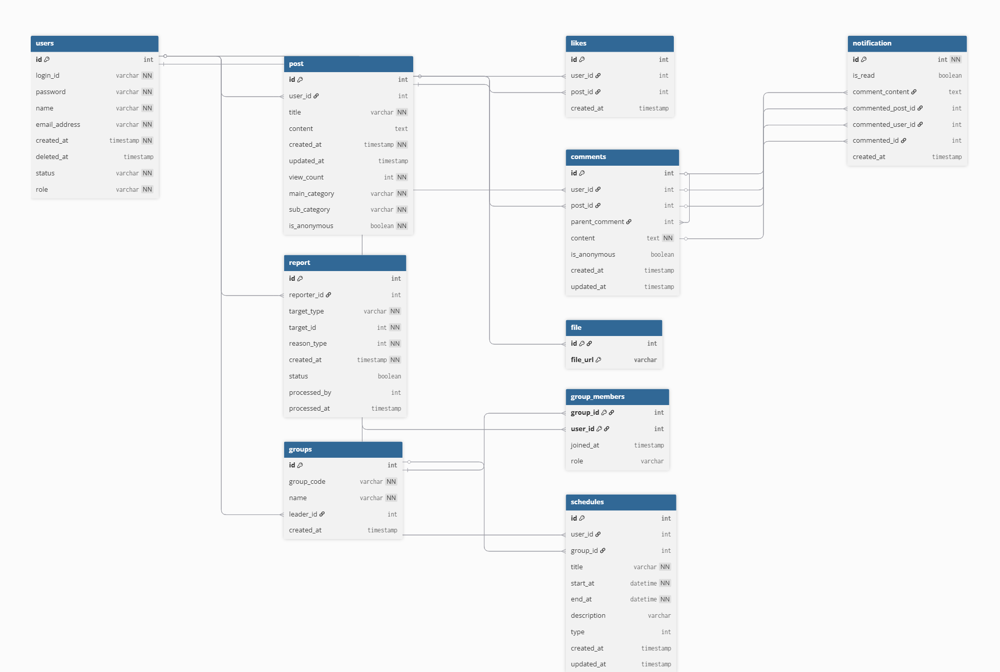
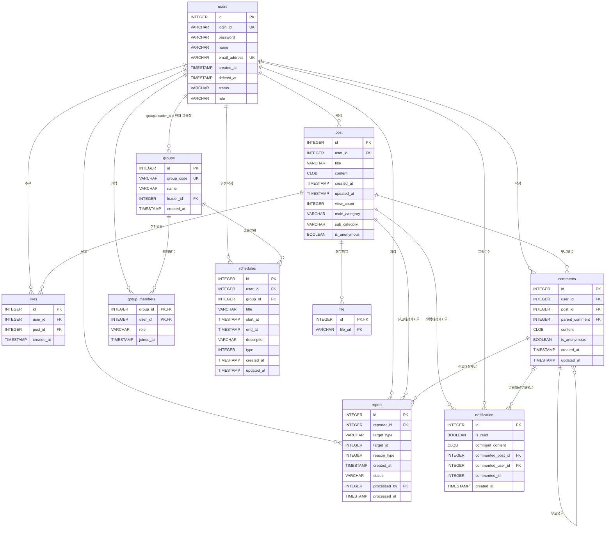

# ERD

## 1. 기준 문서

- 요구사항: `docs/source/requirements.md`
- 논리 스키마: `docs/source/logical-schema.md`
- 물리 스키마: `docs/source/physical-schema.md`
- 루트 ERD 이미지: `erd_수정.png`

이 문서는 최신 요구사항, 논리 스키마, 물리 스키마를 기준으로 ERD를 정리한다. 구현 시 주의할 계약은 `8. 구현 메모`에 기록한다.

## 2. 범례

- `PK`: 기본키
- `FK`: 외래키
- `UK`: 유니크 제약
- `NN`: NOT NULL
- `NULL`: NULL 허용

## 3. 원본 ERD 이미지

## 4. 전체 ERD

## 5. 엔티티 상세

### 5-1. users

회원 계정을 저장한다. 회원은 `login_id`가 아니라 `id`로 식별한다. 탈퇴 회원 row는 물리 삭제하지 않고 유지하며, 개인정보성 컬럼은 NULL 또는 식별 불가 값으로 변경될 수 있다.

| 컬럼 | 타입 | 키/제약 | NULL | 설명 |
|---|---:|---|---|---|
| `id` | INTEGER | PK, identity | NN | 회원 식별자 |
| `login_id` | VARCHAR(50) | UK | NULL | 로그인 아이디. 탈퇴 회원은 NULL 가능 |
| `password` | VARCHAR(255) |  | NULL | 비밀번호. 탈퇴 회원은 NULL 또는 식별 불가 값 가능 |
| `name` | VARCHAR(50) |  | NULL | 이름. 탈퇴 회원은 NULL 또는 식별 불가 값 가능 |
| `email_address` | VARCHAR(255) | UK | NULL | 이메일 주소. 탈퇴 회원은 NULL 가능 |
| `created_at` | TIMESTAMP | default current timestamp | NN | 가입 일시 |
| `deleted_at` | TIMESTAMP |  | NULL | 회원 탈퇴 일시 |
| `status` | VARCHAR(20) | default `ACTIVE`, allowed `ACTIVE`, `DELETED` | NN | 회원 상태 |
| `role` | VARCHAR(20) | default `USER`, allowed `USER`, `ADMIN` | NN | 사용자 역할 구분. ADMIN은 DB seed 데이터 또는 운영자의 직접 DB 변경으로만 부여 |

### 5-2. post

회원이 작성한 게시글을 저장한다. 익명 게시글도 내부적으로 작성자 `user_id`를 유지한다.

| 컬럼 | 타입 | 키/제약 | NULL | 설명 |
|---|---:|---|---|---|
| `id` | INTEGER | PK, identity | NN | 게시글 식별자 |
| `user_id` | INTEGER | FK → `users.id` | NN | 게시글 작성자 |
| `title` | VARCHAR(255) |  | NN | 게시글 제목 |
| `content` | CLOB |  | NULL | 게시글 본문 |
| `created_at` | TIMESTAMP | default current timestamp | NN | 작성 일시 |
| `updated_at` | TIMESTAMP |  | NULL | 수정 일시. NULL이 아니면 수정된 게시글로 판단 |
| `view_count` | INTEGER | default 0, `>= 0` | NN | 조회수 |
| `main_category` | VARCHAR(100) |  | NN | 대주제, 학과 |
| `sub_category` | VARCHAR(100) |  | NN | 소주제, 과목 |
| `is_anonymous` | BOOLEAN | default false | NN | 익명 작성 여부 |

### 5-3. likes

회원의 게시글 추천 이력을 저장한다.

| 컬럼 | 타입 | 키/제약 | NULL | 설명 |
|---|---:|---|---|---|
| `id` | INTEGER | PK, identity | NN | 추천 식별자 |
| `user_id` | INTEGER | FK → `users.id`, UK(`user_id`, `post_id`) | NN | 추천한 회원 |
| `post_id` | INTEGER | FK → `post.id`, UK(`user_id`, `post_id`) | NN | 추천받은 게시글 |
| `created_at` | TIMESTAMP | default current timestamp | NN | 추천 일시 |

### 5-4. comments

게시글의 댓글과 대댓글을 하나의 테이블에 저장한다. `parent_comment`가 NULL이면 일반 댓글이고, 값이 있으면 대댓글이다.

| 컬럼 | 타입 | 키/제약 | NULL | 설명 |
|---|---:|---|---|---|
| `id` | INTEGER | PK, identity | NN | 댓글 식별자 |
| `user_id` | INTEGER | FK → `users.id` | NN | 댓글 작성자 |
| `post_id` | INTEGER | FK → `post.id` | NN | 댓글이 작성된 게시글 |
| `parent_comment` | INTEGER | FK → `comments.id` | NULL | 대댓글의 부모 댓글. NULL이면 최상위 댓글 |
| `content` | CLOB |  | NN | 댓글 또는 대댓글 내용 |
| `is_anonymous` | BOOLEAN | default false | NN | 익명 작성 여부 |
| `created_at` | TIMESTAMP | default current timestamp | NN | 작성 일시 |
| `updated_at` | TIMESTAMP |  | NULL | 수정 일시. NULL이 아니면 수정된 댓글로 판단 |

### 5-5. report

게시글 또는 댓글 신고 이력을 저장한다. 동일 회원은 동일 신고 대상에 대해 한 번만 신고할 수 있다.

| 컬럼 | 타입 | 키/제약 | NULL | 설명 |
|---|---:|---|---|---|
| `id` | INTEGER | PK, identity | NN | 신고 식별자 |
| `reporter_id` | INTEGER | FK → `users.id`, UK(`reporter_id`, `target_type`, `target_id`) | NN | 신고한 회원 |
| `target_type` | VARCHAR(20) | allowed `POST`, `COMMENT`, UK(`reporter_id`, `target_type`, `target_id`) | NN | 신고 대상 유형 |
| `target_id` | INTEGER | UK(`reporter_id`, `target_type`, `target_id`) | NN | 신고 대상 id. `target_type`에 따라 게시글 id 또는 댓글/대댓글 id |
| `reason_type` | INTEGER | allowed `1`, `2`, `3`, `4` | NN | 신고 사유 유형 |
| `created_at` | TIMESTAMP | default current timestamp | NN | 신고 시각 |
| `status` | VARCHAR(20) | default `PENDING`, allowed `PENDING`, `PROCESSED` | NN | 신고 처리 상태 |
| `processed_by` | INTEGER | FK → `users.id` | NULL | 신고를 처리한 관리자 회원 |
| `processed_at` | TIMESTAMP |  | NULL | 신고 처리 시각 |

`target_id`는 다형 대상 참조이므로 단일 FK로 표현하지 않는다. 신고 생성 시점의 실제 대상 존재 여부와 `target_type`에 맞는 대상 테이블 검증은 구현 단계에서 서비스 로직 또는 트리거로 처리한다. 신고 대상 게시글 또는 댓글이 이후 hard delete되어도 `report` 이력은 유지하며, 관리자 신고 목록에서는 해당 신고 대상을 `삭제된 대상`으로 표시한다. 신고 처리 API는 `status`, `processed_by`, `processed_at`만 변경하며 신고 대상 게시글 또는 댓글 삭제를 자동 수행하지 않는다.

### 5-6. groups

그룹 정보를 저장한다. `leader_id`는 현재 그룹장 회원을 가리킨다.

| 컬럼 | 타입 | 키/제약 | NULL | 설명 |
|---|---:|---|---|---|
| `id` | INTEGER | PK, identity | NN | 그룹 식별자 |
| `group_code` | VARCHAR(255) | UK | NN | 그룹 가입 코드. 화면에서 `group_link`라고 표현하는 값과 동일 |
| `name` | VARCHAR(100) |  | NN | 그룹명 |
| `leader_id` | INTEGER | FK → `users.id` | NN | 현재 그룹장 |
| `created_at` | TIMESTAMP | default current timestamp | NN | 생성 일시 |

### 5-7. group_members

회원과 그룹의 다대다 가입 관계를 저장한다. `joined_at`은 그룹장 자동 위임 시 가장 먼저 가입한 그룹원을 판단하는 기준이다.

| 컬럼 | 타입 | 키/제약 | NULL | 설명 |
|---|---:|---|---|---|
| `group_id` | INTEGER | PK, FK → `groups.id` | NN | 그룹 식별자 |
| `user_id` | INTEGER | PK, FK → `users.id` | NN | 회원 식별자 |
| `role` | VARCHAR(20) | allowed `LEADER`, `MEMBER` | NN | 그룹 내 역할 |
| `joined_at` | TIMESTAMP | default current timestamp | NN | 그룹 가입 일시 |

### 5-8. schedules

개인 일정과 그룹 일정을 함께 저장한다. `group_id`가 NULL이면 개인 일정이고, 값이 있으면 그룹 일정이다.

| 컬럼 | 타입 | 키/제약 | NULL | 설명 |
|---|---:|---|---|---|
| `id` | INTEGER | PK, identity | NN | 일정 식별자 |
| `user_id` | INTEGER | FK → `users.id` | NN | 일정 작성자 또는 소유자 |
| `group_id` | INTEGER | FK → `groups.id` | NULL | 그룹 일정의 그룹 식별자 |
| `title` | VARCHAR(255) |  | NN | 일정 제목 |
| `start_at` | TIMESTAMP |  | NN | 시작 일시 |
| `end_at` | TIMESTAMP | `end_at >= start_at` | NN | 종료 일시 |
| `description` | VARCHAR(500) |  | NULL | 일정 설명 또는 메모 |
| `type` | INTEGER | allowed `1`, `2`, `3`, `4`, `5` | NN | 일정 종류. 1: 수업, 2: 과제, 3: 시험, 4: 스터디, 5: 기타 |
| `created_at` | TIMESTAMP | default current timestamp | NN | 생성 일시 |
| `updated_at` | TIMESTAMP |  | NULL | 수정 일시 |

### 5-9. file

게시글 첨부파일을 저장한다. 논리 스키마에 따라 게시글 참조 컬럼명은 `id`를 사용한다. 실제 파일은 `/uploads/posts/{post_id}/{UUID}` 형식의 서버 로컬 경로에 저장하고 DB에는 `file_url`만 저장한다.

| 컬럼 | 타입 | 키/제약 | NULL | 설명 |
|---|---:|---|---|---|
| `id` | INTEGER | PK, FK → `post.id` | NN | 첨부파일이 속한 게시글 |
| `file_url` | VARCHAR(1024) | PK | NN | 업로드된 첨부파일의 저장 위치. 별도 파일 메타데이터는 저장하지 않는다. |

### 5-10. notification

댓글 또는 대댓글로 발생한 알림을 저장한다. 회원은 자신에게 온 알림만 조회할 수 있다.

| 컬럼 | 타입 | 키/제약 | NULL | 설명 |
|---|---:|---|---|---|
| `id` | INTEGER | PK, identity | NN | 알림 식별자 |
| `is_read` | BOOLEAN | default false | NN | 수신자의 알림 확인 여부 |
| `comment_content` | CLOB |  | NN | 알림 발생 당시 표시용 댓글/대댓글 내용. 원본 수정/삭제 후에도 변경하지 않는 스냅샷 값 |
| `commented_post_id` | INTEGER | FK → `post.id` | NN | 댓글이 달린 게시글 id |
| `commented_user_id` | INTEGER | FK → `users.id` | NN | 수신자 유저 id |
| `commented_id` | INTEGER | index only | NULL | 댓글 알림이면 NULL, 대댓글 알림이면 부모 댓글 id. 삭제 cascade FK가 아닌 이동용 힌트 |
| `created_at` | TIMESTAMP | default current timestamp | NN | 알림 생성 일시 |

## 6. 관계 상세

| 관계 | 카디널리티 | 설명 |
|---|---|---|
| `users.id` → `post.user_id` | 1:N | 회원 한 명은 게시글을 여러 개 작성할 수 있고, 게시글 하나는 작성자 한 명만 가진다. |
| `users.id` → `likes.user_id` | 1:N | 회원 한 명은 여러 게시글을 추천할 수 있다. |
| `post.id` → `likes.post_id` | 1:N | 게시글 하나는 여러 추천을 받을 수 있다. |
| `users.id` → `comments.user_id` | 1:N | 회원 한 명은 댓글과 대댓글을 여러 개 작성할 수 있다. |
| `post.id` → `comments.post_id` | 1:N | 게시글 하나는 여러 댓글을 가질 수 있다. |
| `comments.id` → `comments.parent_comment` | 1:N | 일반 댓글 하나는 여러 대댓글의 부모가 될 수 있다. |
| `users.id` → `report.reporter_id` | 1:N | 회원 한 명은 여러 게시글 또는 댓글을 신고할 수 있다. |
| `users.id` → `report.processed_by` | 1:N | 관리자 한 명은 여러 신고를 처리할 수 있다. 미처리 신고의 `processed_by`는 NULL이다. |
| `report.target_type`, `report.target_id` → 신고 대상 | N:1 | 신고 대상은 `target_type`에 따라 `post.id` 또는 `comments.id`를 의미한다. 신고 대상이 hard delete된 경우 `report` 이력은 유지하고 화면에는 `삭제된 대상`으로 표시한다. |
| `users.id` → `groups.leader_id` | 1:N | 회원 한 명은 여러 그룹의 현재 그룹장이 될 수 있다. |
| `groups.id` → `group_members.group_id` | 1:N | 그룹 하나는 여러 회원을 가질 수 있다. |
| `users.id` → `group_members.user_id` | 1:N | 회원 한 명은 여러 그룹에 가입할 수 있다. |
| `users.id` → `schedules.user_id` | 1:N | 회원 한 명은 여러 일정을 작성하거나 소유할 수 있다. |
| `groups.id` → `schedules.group_id` | 1:N | 그룹 하나는 여러 그룹 일정을 가질 수 있다. |
| `post.id` → `file.id` | 1:N | 게시글 하나는 여러 첨부파일을 가질 수 있다. |
| `post.id` → `notification.commented_post_id` | 1:N | 게시글 하나는 여러 알림의 대상 게시글이 될 수 있다. |
| `users.id` → `notification.commented_user_id` | 1:N | 회원 한 명은 여러 알림을 받을 수 있다. |
| `notification.commented_id` | navigation hint | 대댓글 알림에서 부모 댓글 위치로 이동하기 위한 nullable 값이다. 댓글 삭제 cascade FK가 아니다. |

## 7. 주요 제약 조건

- `users.login_id`, `users.email_address`는 중복될 수 없다. 탈퇴 회원의 NULL 값은 DBMS의 UNIQUE NULL 처리 정책을 따른다.
- `users.status`는 `ACTIVE`, `DELETED` 중 하나다.
- `users.role`은 `USER`, `ADMIN` 중 하나다.
- `likes`는 `UNIQUE(user_id, post_id)`로 회원당 게시글 추천을 한 번만 유지하도록 제한한다.
- `comments.parent_comment`가 NULL이면 일반 댓글, 값이 있으면 대댓글이다.
- 대댓글에는 다시 대댓글을 작성할 수 없다는 규칙은 단순 ERD 관계만으로 표현하기 어려우므로 구현 단계에서 서비스 로직 또는 트리거로 검증해야 한다.
- `post.is_anonymous`, `comments.is_anonymous`는 익명 작성 여부를 저장한다. 익명 작성물도 내부적으로 작성자 `user_id`를 유지한다.
- 신고 기능은 `report` 테이블로 관리하며, 게시글 테이블의 신고 여부 플래그는 사용하지 않는다.
- `report`는 `UNIQUE(reporter_id, target_type, target_id)`로 동일 회원이 동일 신고 대상에 대해 한 번만 신고하도록 제한한다.
- `report.target_type`은 `POST`, `COMMENT` 중 하나다.
- `report.reason_type`은 `1`, `2`, `3`, `4` 중 하나다.
- `report.status`는 `PENDING`, `PROCESSED` 중 하나다.
- `report.target_id`는 `target_type`에 따라 `post.id` 또는 `comments.id`를 의미하며, `COMMENT`는 댓글과 대댓글을 모두 포함한다. 신고 생성 시 실제 대상 존재 여부는 구현 단계에서 서비스 로직 또는 트리거로 검증해야 한다. 신고 대상이 이후 hard delete된 경우에도 `report` 이력은 유지한다.
- 탈퇴 회원 작성물은 삭제하지 않고 유지하며, 화면에서는 `탈퇴한 유저`로 표시한다.
- `group_members`는 `PRIMARY KEY(group_id, user_id)`로 한 회원이 같은 그룹에 중복 가입되는 것을 방지한다.
- `group_members.role`은 `LEADER`, `MEMBER` 중 하나다.
- `group_members.joined_at`은 그룹장 자동 위임 시 가장 먼저 가입한 그룹원을 판단하는 기준이다.
- `schedules.group_id`가 NULL이면 개인 일정, NULL이 아니면 그룹 일정이다.
- `schedules.type`은 `1`, `2`, `3`, `4`, `5` 중 하나다.
- `schedules.end_at`은 `start_at`보다 빠를 수 없다.
- `file`은 `PRIMARY KEY(id, file_url)`로 같은 게시글에 같은 파일 저장 위치가 중복 저장되는 것을 방지한다.
- `notification.comment_content`는 알림 발생 당시 표시용 댓글/대댓글 내용을 보관하는 스냅샷 값이며 원본 수정/삭제 후에도 변경하지 않는다.
- `notification.commented_id`는 댓글 알림이면 NULL, 대댓글 알림이면 부모 댓글 id를 저장하는 nullable navigation hint다. 댓글 삭제 cascade FK로 사용하지 않는다.

## 8. 구현 메모

- `notification.commented_id`는 요구사항과 물리 스키마에 따라 NULL을 허용한다. 댓글 알림에서는 NULL, 대댓글 알림에서는 부모 댓글 id를 저장하되 댓글 삭제 cascade FK로 사용하지 않는다.
- `users.login_id`, `users.password`, `users.name`, `users.email_address`는 회원 가입 시 필수 입력값이지만, 탈퇴 처리 후 개인정보 삭제 또는 비식별화를 위해 ERD에서는 NULL 가능 컬럼으로 표현한다.
- `post.updated_at`, `comments.updated_at`은 수정 여부 판단 기준으로 사용한다.
- 신고 이력은 별도 `report` 테이블에 저장한다. 관리자 신고 처리 결과는 `report.status`, `processed_by`, `processed_at`으로만 저장하며, 신고 처리 자체가 게시글/댓글 삭제를 자동 수행하지 않는다. 신고 대상 게시글 또는 댓글이 삭제되어도 `report` 이력은 유지하고 관리자 화면에는 `삭제된 대상`으로 표시한다.
- `groups.leader_id`는 현재 그룹장을 기록한다.
- `file` 테이블은 논리 스키마의 `file(id, file_url)` 정의에 맞춰 게시글 참조 컬럼명을 `id`로 사용한다.
