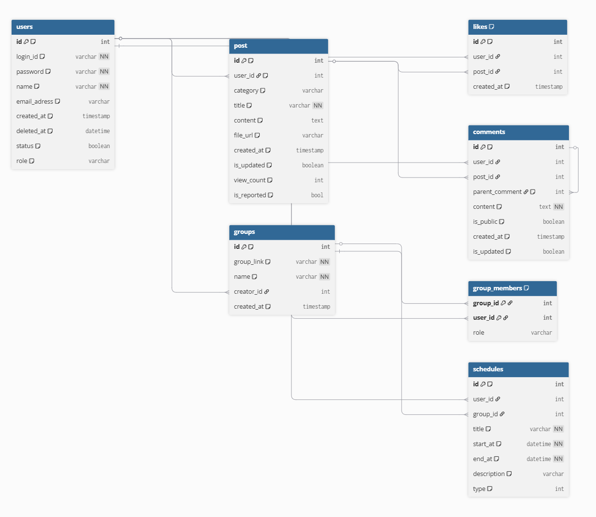

# ERD

이 문서는 루트 디렉터리의 `erd.png`와 `table.md` 내용을 `docs/source` 기준 문서로 옮긴 ERD 원본 정리본이다.

## 원본 자료

- ERD 이미지: [erd.png](../../erd.png)
- 테이블 정의 원본: [table.md](../../table.md)

## ERD 이미지



## 엔티티 요약

### 1. users

사용자 정보를 저장한다.

| 컬럼 | 타입 | 제약 | 설명 |
| --- | --- | --- | --- |
| id | int | PK, increment | 사용자 구분값 |
| login_id | varchar | UNIQUE, NOT NULL | 사용자 아이디 |
| password | varchar | NOT NULL | 비밀번호 |
| name | varchar | NOT NULL | 닉네임 |
| email_adress | varchar |  | 이메일 |
| created_at | timestamp | DEFAULT now() | 생성 일시 |
| deleted_at | datetime |  | 회원 탈퇴 일자 |
| status | boolean |  | 회원 탈퇴 여부 |
| role | varchar |  | 관리자 역할 구분 |

### 2. post

학업 자료 또는 게시글 정보를 저장한다.

| 컬럼 | 타입 | 제약 | 설명 |
| --- | --- | --- | --- |
| id | int | PK, increment | 게시글 구분값 |
| user_id | int | FK -> users.id | 업로드한 사람 |
| category | varchar |  | 자료 분류 |
| title | varchar | NOT NULL | 게시글 제목 |
| content | text |  | 게시글 본문 |
| file_url | varchar |  | 첨부파일 |
| created_at | timestamp | DEFAULT now() | 작성 일시 |
| is_updated | boolean | DEFAULT false | 수정 여부 확인 |
| view_count | int |  | 조회수 |
| is_reported | bool |  | 신고 여부 |

### 3. likes

게시글 추천 정보를 저장한다.

| 컬럼 | 타입 | 제약 | 설명 |
| --- | --- | --- | --- |
| id | int | PK, increment | 추천 구분값 |
| user_id | int | FK -> users.id | 추천한 사용자 |
| post_id | int | FK -> post.id | 추천 대상 게시글 |
| created_at | timestamp | DEFAULT now() | 추천 일시 |

추가 제약:

- UNIQUE (`user_id`, `post_id`): 한 사용자는 하나의 게시글에 한 번만 추천할 수 있다.

### 4. comments

댓글과 대댓글 정보를 저장한다.

| 컬럼 | 타입 | 제약 | 설명 |
| --- | --- | --- | --- |
| id | int | PK, increment | 댓글 구분값 |
| user_id | int | FK -> users.id | 댓글 작성자 |
| post_id | int | FK -> post.id | 댓글이 달린 게시글 |
| parent_comment | int | FK -> comments.id | 대댓글의 부모 댓글 |
| content | text | NOT NULL | 댓글 내용 |
| is_public | boolean | DEFAULT true | 댓글 공개 여부 |
| created_at | timestamp | DEFAULT now() | 댓글 작성 시간 |
| is_updated | boolean | DEFAULT false | 댓글 수정 여부 |

### 5. groups

스터디 그룹 정보를 저장한다.

| 컬럼 | 타입 | 제약 | 설명 |
| --- | --- | --- | --- |
| id | int | PK, increment | 그룹 구분값 |
| group_link | varchar | UNIQUE, NOT NULL | 초대 링크 값 |
| name | varchar | NOT NULL | 그룹 이름 |
| creator_id | int | FK -> users.id | 그룹 생성자 |
| created_at | timestamp | DEFAULT now() | 그룹 생성 일자 |

### 6. group_members

사용자와 그룹의 다대다 가입 관계를 저장한다.

| 컬럼 | 타입 | 제약 | 설명 |
| --- | --- | --- | --- |
| group_id | int | PK, FK -> groups.id | 그룹 구분값 |
| user_id | int | PK, FK -> users.id | 사용자 구분값 |
| role | varchar |  | 그룹 내 역할 |

추가 제약:

- PRIMARY KEY (`group_id`, `user_id`)

### 7. schedules

개인 일정과 그룹 일정을 함께 저장한다.

| 컬럼 | 타입 | 제약 | 설명 |
| --- | --- | --- | --- |
| id | int | PK, increment | 일정 구분값 |
| user_id | int | FK -> users.id | 일정 작성자 또는 개인 일정 소유자 |
| group_id | int | FK -> groups.id | 그룹 일정의 그룹 |
| title | varchar | NOT NULL | 일정 제목 |
| start_at | datetime | NOT NULL | 일정 시작일 |
| end_at | datetime | NOT NULL | 일정 종료일 |
| description | varchar |  | 일정 설명 또는 메모 |
| type | int |  | 일정 유형 |

## 관계 요약

| 관계 | 기준 |
| --- | --- |
| users 1:N post | `post.user_id` -> `users.id` |
| users 1:N likes | `likes.user_id` -> `users.id` |
| post 1:N likes | `likes.post_id` -> `post.id` |
| users 1:N comments | `comments.user_id` -> `users.id` |
| post 1:N comments | `comments.post_id` -> `post.id` |
| comments 1:N comments | `comments.parent_comment` -> `comments.id` |
| users 1:N groups | `groups.creator_id` -> `users.id` |
| groups N:M users | `group_members.group_id` -> `groups.id`, `group_members.user_id` -> `users.id` |
| users 1:N schedules | `schedules.user_id` -> `users.id` |
| groups 1:N schedules | `schedules.group_id` -> `groups.id` |

## DBML 원본

```dbml
// [1] 사용자 (Users)
Table users {
  id int [pk, increment , note:'사용자 구분값']
  login_id varchar [unique, not null, note:'사용자 아이디']
  password varchar [not null, note:'비밀번호']
  name varchar [not null,note:'닉네임']
  email_adress varchar [note:'이메일']
  created_at timestamp [default: `now()`]
  deleted_at datetime [note : '회원탈퇴 일자']
  status boolean [note : '회원탈퇴여부']
  role varchar [note : '관리자 역할 구분']
}

// [2] 학업 자료 (post)
Table post {
  id int [pk, increment, note:'게시글 구분값']
  user_id int [ref: > users.id, note:'업로드한 사람']
  category varchar [note:'자료분류']
  title varchar [not null, note:'게시글 제목']
  content text [note:'게시글 본문']
  file_url varchar [note:'첨부파일']
  created_at timestamp [default: `now()`]
  is_updated boolean [default: false ,note : '수정여부확인']
  view_count int [note : '조회수']
  is_reported bool [note : '신고여부']
}

// [3] 자료 추천 (Likes)
Table likes {
  id int [pk, increment, note:'추천 수']
  user_id int [ref: > users.id]
  post_id int [ref: > post.id]
  created_at timestamp [default: `now()`]

  indexes {
    (user_id, post_id) [unique] // 1인 1추천 보장
  }
}

// [4] 댓글 및 오답노트 (Comments)
Table comments {
  id int [pk, increment, note : '댓글 구분값']
  user_id int [ref: > users.id]
  post_id int [ref: > post.id]
  parent_comment int [ref: > comments.id, note :'대댓글의 부모댓글']
  content text [not null, note : '댓글 내용']
  is_public boolean [default: true, note : '댓글 공개여부']
  created_at timestamp [default: `now()` , note : "댓글 작성시간"]
  is_updated boolean [default: false, note: '댓글의 수정여부 확인']
}

// [5] 스터디 그룹 (Groups)
Table groups {
  id int [pk, increment, note :'그룹 구분값']
  group_link varchar [unique, not null, note : '초대링크 값']
  name varchar [not null, note : '그룹이름']
  creator_id int [ref: > users.id]
  created_at timestamp [default: `now()`, note : '그룹 생성일자']
}

// [6] 그룹 멤버 (group_members)
Table group_members {
  group_id int [ref: > groups.id]
  user_id int [ref: > users.id]
  role varchar // LEADER, MEMBER
  //group_id, user_id 둘다 기본키로 쓰는 것이 아닌
  //인조키를 만들어서(구분하기 위한 값) 관리
  indexes {
    (group_id, user_id) [pk]
  }
}

// [7] 통합 일정 (Schedules)
Table schedules {
  id int [pk, increment ,note : '일정 구분값']
  user_id int [ref: > users.id]
  group_id int [ref: > groups.id]
  title varchar [not null , note :'일정 제목']
  start_at datetime [not null ,note :'일정 시작일']
  end_at datetime [not null , note : '일정 종료일']
  // 일정이 하루라면 시작일과 종료일이 동일하다.
  description varchar [note : '일정 설명/메모']
  type int [note : '일정의 유형(시험, 스터디 등)']
}
```

## 확인 필요 사항

- `users.email_adress`는 ERD/table 원문 표기를 그대로 옮긴 값이다. 이후 네이밍 정규화 단계에서 `email_address`로 수정할지 결정해야 한다.
- `post.file_url`은 단일 첨부파일 컬럼으로 표현되어 있다. 여러 첨부파일을 허용할 경우 별도 파일 테이블 여부를 결정해야 한다.
- `schedules.user_id`와 `schedules.group_id`의 nullable 정책은 ERD에 명시되어 있지 않다. 개인 일정과 그룹 일정을 한 테이블에서 구분하는 규칙을 물리 스키마 단계에서 확정해야 한다.
