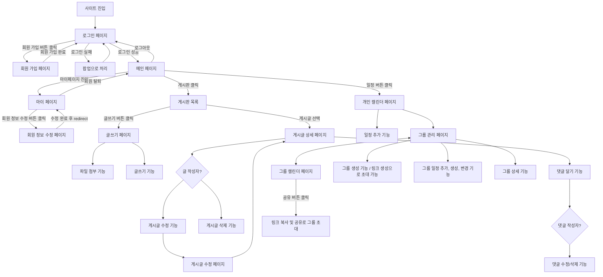

# User Flow

## 1. 기준 자료

- 루트 유저 플로우 이미지: `유저 플로우.png`
- 요구사항: `docs/source/requirements.md`

## 2. 원본 이미지

## 3. 전체 흐름 요약

## 4. 화면 목록

| 화면 ID | 화면 | 진입 경로 | 주요 동작 |
|---|---|---|---|
| `S-01` | 로그인 페이지 | 사이트 진입 | 로그인, 회원 가입 페이지 이동, 로그인 실패 팝업 |
| `S-02` | 회원 가입 페이지 | 로그인 페이지의 회원 가입 버튼 | 회원 가입 완료 후 로그인 페이지 이동 |
| `S-03` | 메인 페이지 | 로그인 성공 | 게시판, 마이페이지, 개인 캘린더 진입, 로그아웃 |
| `S-04` | 마이 페이지 | 메인 페이지 | 회원 정보 수정, 회원 탈퇴 |
| `S-05` | 회원 정보 수정 페이지 | 마이 페이지의 회원 정보 수정 버튼 | 회원 정보 수정 완료 후 마이 페이지로 redirect |
| `S-06` | 게시판 목록 | 메인 페이지의 게시판 클릭 | 게시글 목록 조회, 게시글 상세 진입, 글쓰기 페이지 진입 |
| `S-07` | 게시글 상세 페이지 | 게시판 목록에서 게시글 선택 | 댓글 작성, 게시글 수정/삭제 분기 |
| `S-08` | 글쓰기 페이지 | 게시판 목록의 글쓰기 버튼 | 글 작성, 파일 첨부 |
| `S-09` | 게시글 수정 페이지 | 게시글 상세 페이지의 게시글 수정 기능 | 게시글 수정 후 상세 페이지 이동 |
| `S-10` | 개인 캘린더 페이지 | 메인 페이지의 일정 버튼 | 일정 추가, 그룹 관리 페이지 이동 |
| `S-11` | 그룹 관리 페이지 | 개인 캘린더 페이지 | 그룹 생성, 링크 생성, 그룹 일정 관리, 그룹 상세 기능 |
| `S-12` | 그룹 캘린더 페이지 | 그룹 관리 페이지 | 그룹 일정 조회, 공유 링크 복사 |

## 5. 상세 사용자 흐름

### UF-01. 사이트 진입 및 로그인

| 항목 | 내용 |
|---|---|
| 시작 상태 | 사용자가 사이트에 진입한다. |
| 사용자 액션 | 로그인 페이지에서 아이디와 비밀번호로 로그인한다. |
| 시스템 응답 | 로그인 성공 시 메인 페이지로 이동한다. 로그인 실패 시 팝업으로 실패를 안내하고 로그인 페이지에 머문다. |
| 종료 상태 | 사용자는 메인 페이지에 진입하거나 로그인 실패 안내를 확인한다. |
| 예외/분기 | 로그인 페이지에서 회원 가입 버튼을 클릭하면 회원 가입 페이지로 이동한다. |

### UF-02. 회원 가입

| 항목 | 내용 |
|---|---|
| 시작 상태 | 사용자가 로그인 페이지에 있다. |
| 사용자 액션 | 회원 가입 버튼을 클릭하고 회원 가입 페이지에서 가입 정보를 입력한다. |
| 시스템 응답 | 회원 가입 완료 후 로그인 페이지로 이동한다. |
| 종료 상태 | 사용자는 로그인 페이지에서 가입한 계정으로 로그인할 수 있다. |

### UF-03. 로그아웃

| 항목 | 내용 |
|---|---|
| 시작 상태 | 사용자가 메인 페이지에 있다. |
| 사용자 액션 | 로그아웃을 실행한다. |
| 시스템 응답 | 로그인 페이지로 이동한다. |
| 종료 상태 | 사용자는 로그아웃 상태가 된다. |

### UF-04. 마이 페이지 및 회원 정보 관리

| 항목 | 내용 |
|---|---|
| 시작 상태 | 사용자가 메인 페이지에 있다. |
| 사용자 액션 | 마이 페이지로 이동한다. |
| 시스템 응답 | 마이 페이지를 표시한다. |
| 종료 상태 | 사용자는 회원 정보 수정 또는 회원 탈퇴 기능을 선택할 수 있다. |
| 예외/분기 | 회원 정보 수정 버튼 클릭 시 회원 정보 수정 페이지로 이동한다. 수정 완료 후 마이 페이지로 redirect된다. |
| 예외/분기 | 회원 탈퇴 시 메인 페이지로 연결된다. |

### UF-05. 게시판 목록 및 게시글 상세 조회

| 항목 | 내용 |
|---|---|
| 시작 상태 | 사용자가 메인 페이지에 있다. |
| 사용자 액션 | 게시판을 클릭한다. |
| 시스템 응답 | 게시판 목록을 표시한다. |
| 종료 상태 | 사용자는 게시글 상세 페이지 또는 글쓰기 페이지로 이동할 수 있다. |
| 예외/분기 | 게시글을 선택하면 게시글 상세 페이지로 이동한다. |
| 예외/분기 | 글쓰기 버튼을 클릭하면 글쓰기 페이지로 이동한다. |

### UF-06. 게시글 작성 및 파일 첨부

| 항목 | 내용 |
|---|---|
| 시작 상태 | 사용자가 게시판 목록에 있다. |
| 사용자 액션 | 글쓰기 버튼을 클릭한다. |
| 시스템 응답 | 글쓰기 페이지를 표시한다. |
| 종료 상태 | 사용자는 글쓰기 기능과 파일 첨부 기능을 사용할 수 있다. |

### UF-07. 게시글 수정 및 삭제

| 항목 | 내용 |
|---|---|
| 시작 상태 | 사용자가 게시글 상세 페이지에 있다. |
| 사용자 액션 | 글 작성자인 경우 게시글 수정 또는 삭제 기능을 선택한다. |
| 시스템 응답 | 게시글 수정 선택 시 게시글 수정 페이지를 표시한다. 게시글 수정 완료 후 게시글 상세 페이지로 돌아온다. |
| 종료 상태 | 게시글이 수정되거나 삭제 기능이 수행된다. |
| 예외/분기 | 글 작성자가 아닌 경우 게시글 수정/삭제 기능 흐름으로 진입하지 않는다. |

### UF-08. 댓글 작성, 수정 및 삭제

| 항목 | 내용 |
|---|---|
| 시작 상태 | 사용자가 게시글 상세 페이지에 있다. |
| 사용자 액션 | 댓글 달기 기능을 사용한다. |
| 시스템 응답 | 댓글 작성자 여부를 확인한다. 댓글 작성자인 경우 댓글 수정/삭제 기능을 사용할 수 있다. |
| 종료 상태 | 댓글이 작성되거나 댓글 수정/삭제 기능이 수행된다. |

### UF-09. 개인 캘린더 및 일정 추가

| 항목 | 내용 |
|---|---|
| 시작 상태 | 사용자가 메인 페이지에 있다. |
| 사용자 액션 | 일정 버튼을 클릭한다. |
| 시스템 응답 | 개인 캘린더 페이지를 표시한다. |
| 종료 상태 | 사용자는 개인 일정 추가 기능을 사용할 수 있다. |

### UF-10. 그룹 관리 및 그룹 캘린더

| 항목 | 내용 |
|---|---|
| 시작 상태 | 사용자가 개인 캘린더 페이지에 있다. |
| 사용자 액션 | 그룹 관리 페이지 또는 그룹 캘린더 페이지로 이동한다. |
| 시스템 응답 | 그룹 관리 페이지와 그룹 캘린더 페이지를 전환할 수 있게 한다. |
| 종료 상태 | 사용자는 그룹 일정, 그룹 상세, 그룹 생성 기능을 사용할 수 있다. |
| 예외/분기 | 그룹 캘린더 페이지에서 공유 버튼을 클릭하면 링크가 복사되고, 해당 링크를 공유하여 그룹 초대가 가능하다. |
| 예외/분기 | 그룹 관리 페이지에서 그룹 생성 기능과 링크 생성 기능을 사용할 수 있다. |

## 6. 기능 흐름 요약

| 기능 | 관련 화면 | 흐름 |
|---|---|---|
| 회원 가입 | 로그인 페이지, 회원 가입 페이지 | 로그인 페이지 → 회원 가입 페이지 → 로그인 페이지 |
| 로그인 실패 처리 | 로그인 페이지 | 로그인 실패 → 팝업 안내 → 로그인 페이지 |
| 회원 정보 수정 | 마이 페이지, 회원 정보 수정 페이지 | 마이 페이지 → 회원 정보 수정 페이지 → 마이 페이지 |
| 회원 탈퇴 | 마이 페이지, 메인 페이지 | 마이 페이지 → 회원 탈퇴 기능 → 메인 페이지 |
| 게시글 작성 | 게시판 목록, 글쓰기 페이지 | 게시판 목록 → 글쓰기 페이지 → 글쓰기/파일 첨부 |
| 게시글 수정 | 게시글 상세 페이지, 게시글 수정 페이지 | 게시글 상세 페이지 → 글 작성자 확인 → 게시글 수정 페이지 → 게시글 상세 페이지 |
| 게시글 삭제 | 게시글 상세 페이지 | 게시글 상세 페이지 → 글 작성자 확인 → 게시글 삭제 기능 |
| 댓글 작성 | 게시글 상세 페이지 | 게시글 상세 페이지 → 댓글 달기 기능 |
| 댓글 수정/삭제 | 게시글 상세 페이지 | 댓글 달기 기능 → 댓글 작성자 확인 → 댓글 수정/삭제 기능 |
| 개인 일정 추가 | 개인 캘린더 페이지 | 개인 캘린더 페이지 → 일정 추가 기능 |
| 그룹 초대 | 그룹 캘린더 페이지 | 그룹 캘린더 페이지 → 공유 버튼 클릭 → 링크 복사 및 공유 |
| 그룹 관리 | 그룹 관리 페이지 | 그룹 생성, 링크 생성, 그룹 일정 추가/생성/변경, 그룹 상세 기능 |

## 7. 확인 필요 사항

- 회원 탈퇴 후 메인 페이지로 이동할 때 로그인 상태를 유지하는지, 로그아웃 처리하는지 결정이 필요하다.
- 게시글 삭제 후 이동 위치가 이미지에 명확히 표시되어 있지 않다.
- 댓글 수정/삭제 후 화면 갱신 방식이 이미지에 명확히 표시되어 있지 않다.
- 글쓰기 완료 후 게시판 목록으로 이동하는지, 게시글 상세 페이지로 이동하는지 결정이 필요하다.
