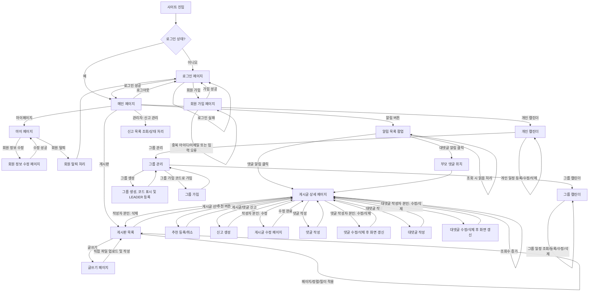

# User Flow

## 1. 기준 자료

- 루트 유저 플로우 이미지: `유저 플로우.png`
- 요구사항: `docs/source/requirements.md`

## 2. 원본 이미지

## 3. 전체 흐름 요약

## 4. 화면 목록

| 화면 ID | 화면 | 진입 경로 | 주요 동작 |
|---|---|---|---|
| `S-01` | 로그인 페이지 | 로그아웃 상태의 사이트 진입 | 로그인, 회원 가입 이동 |
| `S-02` | 회원 가입 페이지 | 로그인 페이지의 회원 가입 버튼 | 이름, 아이디, 비밀번호, 이메일 입력 후 가입 |
| `S-06` | 메인 페이지 | 로그인 성공 | 게시판, 마이페이지, 알림, 개인 캘린더 진입, 로그아웃 |
| `S-07` | 마이 페이지 | 메인 페이지 | 회원 정보 수정, 회원 탈퇴 |
| `S-08` | 회원 정보 수정 페이지 | 마이 페이지 | 이름, 비밀번호, 이메일 수정 |
| `S-09` | 알림 목록 팝업 | 메인 페이지의 알림 버튼 | 본인 알림 조회, 읽음 처리, 알림 대상 이동 |
| `S-10` | 게시판 목록 | 메인 페이지의 게시판 클릭 | 게시글 목록 조회, 페이지네이션, 검색/작성자/주제 필터, 글쓰기 |
| `S-11` | 게시글 상세 페이지 | 게시판 목록 또는 알림 | 조회수 증가, 추천, 신고, 댓글/대댓글, 작성자 표시, 수정/삭제 분기 |
| `S-12` | 글쓰기 페이지 | 게시판 목록의 글쓰기 버튼 | 대주제, 소주제, 제목, 내용, 첨부파일, 익명 여부 입력 |
| `S-13` | 게시글 수정 페이지 | 게시글 상세 페이지의 수정 버튼 | 본인 게시글 수정 |
| `S-14` | 개인 캘린더 페이지 | 메인 페이지의 개인 캘린더 | 개인 일정 조회, 등록, 수정, 삭제 |
| `S-15` | 그룹 관리 페이지 | 개인 캘린더 페이지 | 그룹 생성, 그룹 가입, 그룹 캘린더 이동 |
| `S-16` | 그룹 캘린더 페이지 | 그룹 관리 페이지 | 그룹 일정 조회, 등록, 수정, 삭제 |
| `S-17` | 관리자 신고 관리 페이지 | 메인 페이지의 관리자 신고 관리 | 신고 목록 조회, 신고 처리 |

## 5. 상세 사용자 흐름

### UF-01. 사이트 진입 및 인증 상태 확인

| 항목 | 내용 |
|---|---|
| 시작 상태 | 사용자가 사이트에 진입한다. |
| 사용자 액션 | 사이트 URL에 접근한다. |
| 시스템 응답 | 로그인 상태이면 메인 페이지로 이동하고, 로그아웃 상태이면 로그인 페이지로 이동한다. |
| 종료 상태 | 사용자는 메인 페이지 또는 로그인 페이지에 위치한다. |
| 예외/분기 | 로그아웃 후 또는 세션 무효화 후 인증이 필요한 기능에 접근하면 로그인 페이지로 이동한다. |

### UF-02. 회원 가입

| 항목 | 내용 |
|---|---|
| 시작 상태 | 사용자가 로그인 페이지에 있다. |
| 사용자 액션 | 회원 가입 페이지로 이동해 이름, 아이디, 비밀번호, 이메일을 입력한다. |
| 시스템 응답 | 아이디와 이메일 중복 여부를 확인하고, 가입 성공 시 로그인 페이지로 이동한다. |
| 종료 상태 | 사용자는 로그인 페이지에서 가입한 계정으로 로그인할 수 있다. |
| 예외/분기 | 아이디 또는 이메일이 이미 사용 중이면 가입을 완료하지 않고 회원 가입 페이지에 머문다. 단, 탈퇴 회원의 NULL 처리된 아이디/이메일은 중복 판단 대상에서 제외된다. |

### UF-03. 로그인 및 로그아웃

| 항목 | 내용 |
|---|---|
| 시작 상태 | 사용자가 로그인 페이지에 있다. |
| 사용자 액션 | 아이디와 비밀번호를 입력해 로그인한다. |
| 시스템 응답 | 로그인 성공 시 메인 페이지로 이동한다. 로그인 실패 시 실패를 안내하고 로그인 페이지에 머문다. |
| 종료 상태 | 사용자는 메인 페이지에 진입하거나 로그인 실패 안내를 확인한다. |
| 예외/분기 | 사용자가 로그아웃하면 서버에 저장된 세션을 무효화하고 로그인 페이지로 이동한다. |

### UF-05. 회원 정보 수정

| 항목 | 내용 |
|---|---|
| 시작 상태 | 로그인한 사용자가 마이 페이지에 있다. |
| 사용자 액션 | 회원 정보 수정 페이지로 이동해 이름, 비밀번호, 이메일 중 하나 이상을 변경한다. 비밀번호를 변경하는 경우 현재 비밀번호를 함께 입력한다. |
| 시스템 응답 | 기존 정보와 동일한 내용인지 확인하고, 이메일 변경 시 중복 여부를 확인한다. 비밀번호 변경 시 현재 비밀번호 일치 여부를 확인한다. 변경 가능한 값이면 수정 후 마이 페이지로 이동한다. |
| 종료 상태 | 사용자의 회원 정보가 변경된다. |
| 예외/분기 | 기존 정보와 동일한 내용으로 수정하려 하면 수정이 완료되지 않는다. |
| 예외/분기 | 변경하려는 이메일이 이미 사용 중이면 수정이 완료되지 않는다. 단, 탈퇴 회원의 NULL 처리된 이메일은 중복 판단 대상에서 제외된다. |
| 예외/분기 | 비밀번호 변경 시 현재 비밀번호가 누락되거나 기존 비밀번호와 일치하지 않으면 수정이 완료되지 않는다. |

### UF-06. 회원 탈퇴

| 항목 | 내용 |
|---|---|
| 시작 상태 | 로그인한 사용자가 마이 페이지에 있다. |
| 사용자 액션 | 회원 탈퇴를 실행한다. |
| 시스템 응답 | 회원 row는 유지하고 `deleted_at`을 기록하며 `status`를 `DELETED`로 변경한다. 개인정보성 컬럼은 탈퇴 처리 시점에 즉시 변경하지 않고, `deleted_at`으로부터 6개월이 지난 뒤 정책에 따라 NULL 값 또는 식별할 수 없는 값으로 변경한다. |
| 종료 상태 | 사용자는 즉시 로그아웃 처리되고 로그인 페이지로 이동한다. |
| 예외/분기 | 탈퇴 회원의 게시글, 댓글, 대댓글은 삭제하지 않고 작성자명을 `탈퇴한 유저`로 표시한다. |
| 예외/분기 | 탈퇴 회원의 개인 캘린더와 개인 일정은 즉시 삭제된다. |
| 예외/분기 | 탈퇴 시점에 해당 회원은 가입되어 있던 모든 그룹에서 탈퇴 처리된다. |
| 예외/분기 | 탈퇴 회원이 그룹장인 그룹은 탈퇴 처리 전에 가장 먼저 가입한 다른 그룹원에게 LEADER 권한을 위임한다. 유일한 그룹원이면 해당 그룹을 즉시 삭제한다. |

### UF-07. 알림 조회, 읽음 처리 및 이동

| 항목 | 내용 |
|---|---|
| 시작 상태 | 로그인한 사용자가 메인 페이지에 있다. |
| 사용자 액션 | 알림 버튼을 클릭한다. |
| 시스템 응답 | 사용자 본인에게 온 알림 목록을 팝업으로 표시하고, 조회된 알림을 읽음 처리한다. |
| 종료 상태 | 사용자는 알림 목록을 확인한다. |
| 예외/분기 | 댓글 알림을 클릭하면 해당 게시글 상세 화면으로 이동한다. |
| 예외/분기 | 대댓글 알림을 클릭하면 대댓글이 달린 부모 댓글 위치로 이동한다. |
| 예외/분기 | 다른 회원에게 온 알림은 조회할 수 없다. |

### UF-08. 게시판 목록 조회 및 필터링

| 항목 | 내용 |
|---|---|
| 시작 상태 | 로그인한 사용자가 메인 페이지에 있다. |
| 사용자 액션 | 게시판으로 이동한다. |
| 시스템 응답 | 작성일 기준 최신순으로 게시글 목록을 페이지 번호 기반 페이지네이션으로 표시한다. |
| 종료 상태 | 사용자는 게시글 상세 페이지 또는 글쓰기 페이지로 이동할 수 있다. |
| 예외/분기 | 제목/내용 검색어 필터, 작성자 필터, 주제 필터 중 하나를 선택해 적용할 수 있다. |
| 예외/분기 | 작성자 필터 결과에서는 탈퇴한 유저의 게시글과 익명 유저의 게시글을 제외한다. |

### UF-09. 게시글 작성 및 파일 첨부

| 항목 | 내용 |
|---|---|
| 시작 상태 | 로그인한 사용자가 게시판 목록에 있다. |
| 사용자 액션 | 글쓰기 페이지에서 대주제, 소주제, 제목, 내용, 첨부파일, 익명 여부를 입력한다. |
| 시스템 응답 | 게시글을 작성자의 `user_id`와 함께 저장하고, 첨부파일은 사용자가 직접 업로드한 파일로 처리한다. 실제 파일은 `/uploads/posts/{post_id}/{UUID}` 형식의 서버 로컬 경로에 저장하고 DB에는 `file_url`만 저장한다. |
| 종료 상태 | 작성 완료 후 게시판 첫 번째 페이지로 이동한다. |
| 예외/분기 | 익명 게시글이어도 시스템 내부에서는 작성자의 `user_id`를 유지한다. |
| 예외/분기 | 파일명, 원본 파일명, 파일 크기, MIME 타입, 확장자 등 별도 파일 메타데이터는 DB에 저장하지 않는다. |

### UF-10. 게시글 상세 조회, 수정 및 삭제

| 항목 | 내용 |
|---|---|
| 시작 상태 | 로그인한 사용자가 게시판 목록에 있다. |
| 사용자 액션 | 게시글을 선택해 상세 화면에 접근한다. |
| 시스템 응답 | 게시글 상세 화면을 표시하고 조회수를 증가시킨다. |
| 종료 상태 | 사용자는 게시글을 읽고 추천, 댓글, 대댓글 기능을 사용할 수 있다. |
| 예외/분기 | 게시글 작성자 본인은 게시글을 수정하거나 삭제할 수 있다. 수정 시 수정 여부를 기록한다. |
| 예외/분기 | 게시글 수정 시 새 파일이 업로드되면 기존 첨부파일 목록을 전체 교체하고, 새 파일이 업로드되지 않으면 기존 첨부파일 목록을 유지한다. |
| 예외/분기 | 게시글 삭제 완료 후 게시판 첫 번째 페이지로 이동한다. |
| 예외/분기 | 다른 회원이 작성한 게시글은 수정하거나 삭제할 수 없다. |

### UF-11. 게시글 추천 등록 및 취소

| 항목 | 내용 |
|---|---|
| 시작 상태 | 로그인한 사용자가 게시글 상세 페이지에 있다. |
| 사용자 액션 | 추천 버튼을 클릭한다. |
| 시스템 응답 | 아직 추천하지 않은 게시글이면 추천을 등록하고 버튼 색상을 변경한다. 이미 추천한 게시글이면 추천을 취소하고 버튼 색상을 원래 상태로 되돌린다. |
| 종료 상태 | 해당 회원의 게시글 추천 상태가 등록 또는 취소된다. |
| 예외/분기 | 회원은 하나의 게시글에 대해 추천을 한 번만 유지할 수 있다. |

### UF-11A. 게시글 또는 댓글 신고

| 항목 | 내용 |
|---|---|
| 시작 상태 | 일반 사용자로 로그인한 회원이 게시글 상세 페이지에 있다. |
| 사용자 액션 | 게시글 또는 댓글의 신고 버튼을 클릭하고 정해진 신고 사유 유형 중 하나를 선택한다. |
| 시스템 응답 | 신고자 id, 신고 대상 유형, 신고 대상 id, 신고 사유 유형, 신고 시각, 신고 처리 상태를 `report` 테이블에 저장한다. 신고 생성 시 처리자와 처리 시각은 비워 둔다. |
| 종료 상태 | 해당 신고 이력이 저장되고 사용자는 게시글 상세 페이지에 머문다. |
| 예외/분기 | 동일 회원이 동일 신고 대상에 대해 이미 신고한 경우 중복 신고를 허용하지 않는다. |
| 예외/분기 | 신고 대상 유형은 게시글과 댓글을 구분한다. |
| 예외/분기 | 신고 사유 유형은 1: 부적절한 내용, 2: 광고/도배, 3: 저작권 침해, 4: 기타 중 하나다. |
| 예외/분기 | 신고 생성 후 신고 대상 게시글 또는 댓글이 삭제되어도 신고 이력은 유지하고, 관리자 신고 목록에서는 신고 대상을 `삭제된 대상`으로 표시한다. |

### UF-12. 댓글 작성, 수정 및 삭제

| 항목 | 내용 |
|---|---|
| 시작 상태 | 로그인한 사용자가 게시글 상세 페이지에 있다. |
| 사용자 액션 | 댓글 내용과 익명 여부를 입력해 댓글을 작성한다. |
| 시스템 응답 | 댓글을 작성자의 `user_id`와 게시글 id에 연결해 저장한다. 댓글 작성자가 게시글 작성자와 다른 회원이면 게시글 작성자에게 댓글 알림을 생성한다. |
| 종료 상태 | 게시글 상세 화면에 댓글이 표시된다. |
| 예외/분기 | 댓글 작성자가 게시글 작성자와 같은 회원이면 자기 자신의 게시글에 댓글을 작성한 경우이므로 댓글 알림을 생성하지 않는다. |
| 예외/분기 | 댓글 작성자 본인은 댓글을 수정하거나 삭제할 수 있다. 수정 시 수정 여부를 기록한다. |
| 예외/분기 | 댓글을 수정하거나 삭제하면 해당 페이지 전체 화면을 갱신하고, 갱신 시점의 게시글 또는 다른 댓글 변경 사항도 함께 반영한다. |
| 예외/분기 | 다른 회원이 작성한 댓글은 조회할 수 있지만 수정하거나 삭제할 수 없다. |

### UF-13. 대댓글 작성, 수정 및 삭제

| 항목 | 내용 |
|---|---|
| 시작 상태 | 로그인한 사용자가 게시글 상세 페이지의 댓글을 보고 있다. |
| 사용자 액션 | 특정 댓글에 대댓글 내용과 익명 여부를 입력한다. |
| 시스템 응답 | 대댓글을 작성자의 `user_id`, 게시글 id, 부모 댓글 id에 연결해 저장한다. 대댓글 작성자가 부모 댓글 작성자와 다른 회원이면 부모 댓글 작성자에게 대댓글 알림을 생성한다. |
| 종료 상태 | 부모 댓글 아래에 대댓글이 표시된다. |
| 예외/분기 | 대댓글에는 다시 대댓글을 작성할 수 없다. |
| 예외/분기 | 대댓글 작성자가 부모 댓글 작성자와 같은 회원이면 자기 자신의 댓글에 대댓글을 작성한 경우이므로 댓글 알림을 생성하지 않는다. |
| 예외/분기 | 대댓글 작성자 본인은 대댓글을 수정하거나 삭제할 수 있다. 수정 시 수정 여부를 기록한다. |
| 예외/분기 | 대댓글을 수정하거나 삭제하면 해당 페이지 전체 화면을 갱신하고, 갱신 시점의 게시글 또는 다른 댓글 변경 사항도 함께 반영한다. |
| 예외/분기 | 다른 회원이 작성한 대댓글은 조회할 수 있지만 수정하거나 삭제할 수 없다. |

### UF-14. 익명 및 탈퇴 작성자 표시

| 항목 | 내용 |
|---|---|
| 시작 상태 | 사용자가 게시글 목록 또는 게시글 상세 화면을 조회한다. |
| 사용자 액션 | 게시글, 댓글, 대댓글의 작성자 표시 영역을 확인한다. |
| 시스템 응답 | 익명 작성물은 작성자 이름 대신 `익명_숫자`로 표시한다. 동일한 게시글 상세 화면 안에서 동일 작성자는 항상 같은 `익명_숫자`로 표시한다. |
| 종료 상태 | 사용자는 요구사항에 맞는 작성자 표시명을 확인한다. |
| 예외/분기 | 탈퇴 회원의 작성물은 익명 여부보다 `탈퇴한 유저` 표시를 우선한다. |
| 예외/분기 | 탈퇴 회원의 작성물은 게시글 및 댓글 조회, 검색, 페이지네이션 대상에 포함된다. |

### UF-15. 개인 일정 조회, 등록, 수정 및 삭제

| 항목 | 내용 |
|---|---|
| 시작 상태 | 로그인한 사용자가 메인 페이지에 있다. |
| 사용자 액션 | 개인 캘린더로 이동한다. |
| 시스템 응답 | 사용자의 개인 일정을 달력 형태로 표시한다. |
| 종료 상태 | 사용자는 자신의 개인 일정을 조회한다. |
| 예외/분기 | 사용자는 날짜, 시작 시간, 종료 시간, 일정 종류, 일정 제목, 메모를 입력해 개인 일정을 등록할 수 있다. 일정 종류는 1: 수업, 2: 과제, 3: 시험, 4: 스터디, 5: 기타 중 하나다. |
| 예외/분기 | 사용자는 자신의 개인 일정만 수정하거나 삭제할 수 있다. 타인의 개인 일정은 조회, 수정, 삭제할 수 없다. |
| 예외/분기 | 개인 일정의 상세 조회, 수정, 삭제는 캘린더 화면 내 모달을 통해 처리한다. |

### UF-16. 그룹 생성 및 가입

| 항목 | 내용 |
|---|---|
| 시작 상태 | 로그인한 사용자가 그룹 관리 페이지에 있다. |
| 사용자 액션 | 그룹명을 입력해 그룹을 생성하거나 그룹 가입 코드를 입력해 그룹에 가입한다. |
| 시스템 응답 | 그룹 생성 시 그룹 id, 그룹명, 현재 그룹장, 그룹 가입 코드를 저장하고 그룹을 생성한 회원을 `leader_id`와 `group_members`의 `LEADER`로 자동 등록한다. 생성된 그룹 가입 코드를 화면에 보여준다. |
| 종료 상태 | 사용자는 생성하거나 가입한 그룹의 그룹원이 된다. |
| 예외/분기 | 회원은 여러 그룹에 들어갈 수 있고, 하나의 그룹에는 여러 회원이 들어갈 수 있다. |
| 예외/분기 | 화면에서 `group_link`라고 표현하는 값은 가입자가 입력하는 그룹 가입 코드와 같은 값이다. 별도 초대 URL, 외부 공유 기능, 만료 시간, 재발급 기능은 구현하지 않는다. |
| 예외/분기 | 그룹 채팅은 구현하지 않는다. |

### UF-17. 그룹 일정 조회, 등록, 수정 및 삭제

| 항목 | 내용 |
|---|---|
| 시작 상태 | 로그인한 사용자가 자신이 속한 그룹의 그룹 캘린더에 있다. |
| 사용자 액션 | 그룹 일정을 조회, 등록, 수정 또는 삭제한다. |
| 시스템 응답 | 그룹 id와 작성자를 기준으로 그룹 일정을 저장하거나 변경하고, 그룹 캘린더에 반영한다. |
| 종료 상태 | 그룹 캘린더의 일정이 조회 또는 변경된다. |
| 예외/분기 | 모든 그룹원은 자신이 속한 그룹 캘린더의 그룹 일정을 자유롭게 조회, 등록, 수정, 삭제할 수 있다. |
| 예외/분기 | 타 그룹 캘린더의 그룹 일정은 조회, 등록, 수정, 삭제할 수 없다. |
| 예외/분기 | 그룹 일정 종류는 개인 일정과 동일하게 1: 수업, 2: 과제, 3: 시험, 4: 스터디, 5: 기타 중 하나다. |

### UF-18. 관리자 신고 목록 조회 및 처리

| 항목 | 내용 |
|---|---|
| 시작 상태 | 관리자로 로그인한 회원이 메인 페이지에 있다. |
| 사용자 액션 | 신고 관리 화면으로 이동한다. |
| 시스템 응답 | 신고 대상, 신고자, 신고 사유, 신고 시각, 신고 처리 상태, 처리자, 처리 시각을 포함한 신고 목록을 표시한다. 신고 대상 게시글 또는 댓글이 삭제된 경우 신고 대상은 `삭제된 대상`으로 표시한다. |
| 종료 상태 | 관리자는 신고 내역을 확인하고 신고 상태를 처리 완료로 변경할 수 있다. |
| 예외/분기 | 관리자 역할이 아닌 회원은 신고 목록을 조회하거나 처리할 수 없다. |
| 예외/분기 | 신고 처리는 `report.status`, `processed_by`, `processed_at`만 변경하며 신고 대상 게시글 또는 댓글 삭제를 자동 수행하지 않는다. |

## 6. 기능 흐름 요약

| 기능 | 관련 화면 | 흐름 |
|---|---|---|
| 사이트 진입 | 로그인 페이지, 메인 페이지 | 사이트 진입 → 로그인 상태 확인 → 메인 또는 로그인 페이지 |
| 회원 가입 | 로그인 페이지, 회원 가입 페이지 | 로그인 페이지 → 회원 가입 페이지 → 가입 성공 → 로그인 페이지 |
| 로그인 | 로그인 페이지, 메인 페이지 | 아이디/비밀번호 입력 → 로그인 성공 → 메인 페이지 |
| 로그아웃 | 메인 페이지, 로그인 페이지 | 로그아웃 → 세션 무효화 → 로그인 페이지 |
| 회원 정보 수정 | 마이 페이지, 회원 정보 수정 페이지 | 마이 페이지 → 정보 수정 → 마이 페이지 |
| 회원 탈퇴 | 마이 페이지, 로그인 페이지 | 탈퇴 처리 → `deleted_at`/`status` 기록 → 세션 무효화 → 로그인 페이지 → 6개월 이후 개인정보 null 처리 |
| 알림 조회 | 메인 페이지, 알림 팝업, 게시글 상세 | 알림 버튼 → 본인 알림 팝업 → 읽음 처리 → 대상 위치 이동 |
| 게시글 목록 | 게시판 목록 | 최신순 페이지네이션 → 검색어/작성자/주제 중 하나의 필터 적용 |
| 게시글 작성 | 게시판 목록, 글쓰기 페이지 | 글쓰기 → 익명 여부 및 파일 업로드 → 게시판 첫 번째 페이지 |
| 게시글 수정/삭제 | 게시글 상세, 게시글 수정 페이지 | 작성자 확인 → 수정 또는 삭제 → 상세 또는 게시판 첫 번째 페이지 |
| 게시글 추천 | 게시글 상세 | 추천 버튼 → 추천 등록 또는 취소 |
| 신고 | 게시글 상세, 관리자 신고 관리 | 게시글/댓글 신고 → 관리자 신고 목록 조회 → 신고 상태 처리 |
| 댓글 관리 | 게시글 상세 | 댓글 작성 → 작성자 확인 → 수정/삭제 → 전체 화면 갱신 |
| 대댓글 관리 | 게시글 상세 | 부모 댓글 선택 → 대댓글 작성 → 작성자 확인 → 수정/삭제 → 전체 화면 갱신 |
| 작성자 표시 | 게시판 목록, 게시글 상세 | 익명 작성자 `익명_숫자`, 탈퇴 작성자 `탈퇴한 유저` 표시 |
| 개인 일정 | 개인 캘린더 | 개인 일정 조회 → 등록/수정/삭제 |
| 그룹 생성/가입 | 그룹 관리 | 그룹 생성 → 가입 코드 표시 및 현재 그룹장 `leader_id`/LEADER 등록 또는 그룹 가입 코드로 가입 |
| 그룹 일정 | 그룹 캘린더 | 그룹원 확인 → 그룹 일정 조회/등록/수정/삭제 |
| 관리자 신고 관리 | 관리자 신고 관리 | 관리자 확인 → 신고 목록 조회 → 신고 상태 처리 |

## 7. 확인 필요 사항

현재 요구사항 기준으로 유저 플로우에 남은 확인 필요 사항은 없다.
